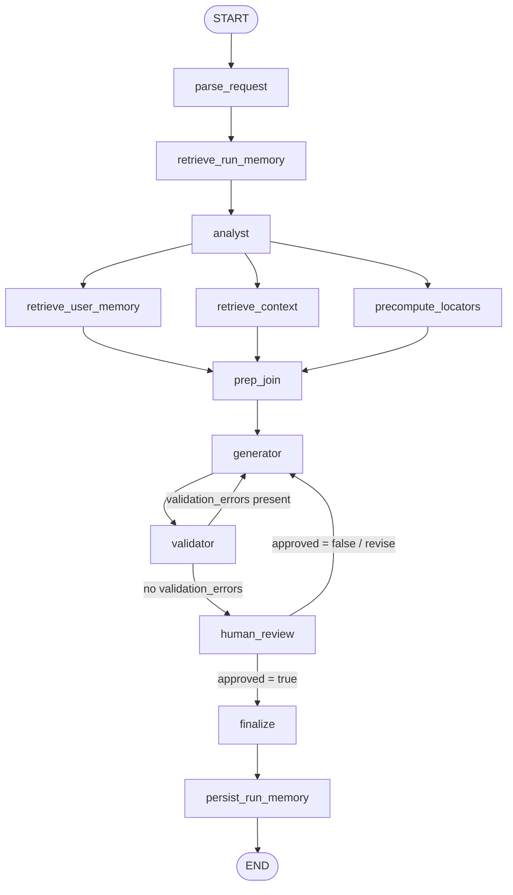

# QA Automation Multi-Agent Workflow

This project is an **assignment-ready QA automation multi-agent workflow** implemented as a Jupyter notebook.

It demonstrates how to:

- Read a user story (mock Jira key lookup or raw text)
- Extract acceptance criteria
- Generate robust UI locators from an HTML DOM snippet
- Retrieve relevant example tests from a Chroma vector store to guide generation
- Generate framework-specific automation test code (Cypress TS or Playwright TS)
- Pause for **Human-in-the-Loop (HITL)** approval/revision (simulated queue or interactive input)
- Pause/resume execution via **LangGraph interrupts** (with queued decisions for non-interactive demos)
- Keep **persistent checkpoints** using SQLite (fallback to `MemorySaver` if SQLite saver is unavailable)
- Capture lightweight run summaries into a Chroma “run memory” collection for future runs
- Store **per-user long-term memory** (scoped by `user_id`) in a separate Chroma collection

The core deliverable is the notebook: `QA_Automation_Multi_Agent_Workflow.ipynb`.

---

## Project Structure

### Notebook Structure Diagram

```mermaid
flowchart TB
  A[QA_Automation_Multi_Agent_Workflow.ipynb]
  A --> B[1) Overview & Scenario]
  A --> C[2) Environment & Dependencies]
  A --> D[3) Helpers]
  A --> E[4) Mock Data & Supported Targets]
  A --> F[5) Tools]
  A --> G[6) Agents & Prompts]
  A --> H[7) LangGraph Workflow]
  A --> I[8) Execution Harness & Test Cases]
```

### 1) Overview & Scenario

- Problem framing: QA Test Design Assistant with multi-agent workflow
- Capabilities: story ingestion, criteria extraction, locator generation, test generation, HITL approval

### 2) Environment & Dependencies

- Install cell for Colab
- API key + LangSmith tracing configuration (Colab secrets or local env vars)

### 3) Helpers

- Graph rendering helper (`display_graph`)
- Utility helpers (e.g., `extract_last_text`, slugifying)

### 4) Mock Data & Supported Targets

- Mock Jira story source (`MOCK_JIRA_STORIES`)
- Sample HTML DOM snippets (`HTML_SAMPLES`)
- Supported test targets (`SUPPORTED_FRAMEWORKS`)

### 5) Tools

- `read_user_story` (Jira key → story text, or passthrough)
- `extract_acceptance_criteria` (story text → acceptance criteria JSON)
- `generate_locators_from_dom` (HTML → locator map JSON)
- `build_test_template` (criteria + locators → Cypress/Playwright test code)
- `retrieve_examples` (RAG: retrieve similar examples from Chroma)

### 6) Agents & Prompts

- Analyst system prompt (criteria extraction)
- Generator system prompt (locators + test code)
- Validator system prompt (coherence/usability checks)
- Tool-bound models for analyst/generator

### 7) LangGraph Workflow

- `WorkflowState` schema (TypedDict)
- Nodes (high level): parse → retrieve_run_memory → analyst → (retrieve_user_memory + retrieve_context + precompute_locators in parallel) → prep_join → generator → validator → human_review → finalize → persist_run_memory
- Conditional routing (regenerate on validation issues; regenerate on non-approval)
- Checkpointing: SQLite-backed saver (persistent) keyed by `thread_id` (fallback to `MemorySaver`)

### 8) Execution Harness & Test Cases

- `execute_workflow(user_request: str)` runs the workflow end-to-end
- HITL simulation queue helpers (`enqueue_hitl_responses`)
- Example run + >= 5 assignment test cases (approve/revise flows)

---

## What’s Inside the Notebook

### Key components

**1) Mock inputs**

- **Mock Jira stories** (`MOCK_JIRA_STORIES`) for predictable demo runs
- **HTML DOM samples** (`HTML_SAMPLES`) to generate locator maps
- **Supported frameworks** (`SUPPORTED_FRAMEWORKS`)

**2) Tools (LangChain tools)**
The notebook registers multiple tools using `@tool`:

- `read_user_story(story_input: str) -> str`
- `extract_acceptance_criteria(user_story: str) -> str` (returns JSON string)
- `generate_locators_from_dom(html_dom: str) -> str` (returns JSON string)
- `build_test_template(framework, feature_name, acceptance_criteria_json, locators_json) -> str`
- `retrieve_examples(query: str, framework: str = "", k: int = 3) -> str` (returns JSON string)

**3) Multi-agent workflow (LangGraph)**
A `WorkflowState` (`TypedDict`) carries state between nodes. The graph composes:

- `parse_request` → normalize the incoming request
- `retrieve_run_memory` → query prior run summaries (Chroma) to surface useful patterns
- `analyst` → Story Analyst Agent extracts acceptance criteria
- `retrieve_context` → retrieve similar example tests (Chroma) for generation guidance
- `precompute_locators` → precompute robust selectors from the DOM snippet
- `prep_join` → safely merge parallel branch outputs into a single analysis context
- `generator` → Test Author Agent generates locators + test code
- `validator` → Validation Agent checks outputs and may request regeneration
- `human_review` → HITL decision step (approve or revise)
- `finalize` → produce final JSON payload (includes all artifacts)
- `persist_run_memory` → embed a concise run summary into Chroma for future runs

**4) Required core function**

- `execute_workflow(user_request: str) -> Dict[str, Any]`

This is the main entrypoint you can call with either:

- A raw story key/text, or
- A JSON string containing story/framework/html_dom metadata

It runs the workflow until completion; the `human_review` node obtains a decision either from the simulated HITL queue or via `input(...)`.

For notebook demos, `execute_workflow` will auto-resume HITL interrupts using queued decisions from `enqueue_hitl_responses(...)`.

---

## Setup

### Option A — Run in Google Colab

The notebook includes a Colab-friendly install cell:

```python
%pip install -q -U langgraph langgraph-checkpoint-sqlite langchain-core langchain-openai langsmith chromadb beautifulsoup4 lxml tiktoken
```

Then set secrets in Colab:

- `OPENAI_API_KEY` (required)
- `LANGSMITH_API_KEY` (optional, if you want tracing)

### Option B — Run locally (Jupyter)

Prereqs:

- Python 3.10+ recommended
- Jupyter installed (via `pip install jupyter` or use VS Code notebooks)

Install deps:

```bash
%pip install -U langgraph langgraph-checkpoint-sqlite langchain-core langchain-openai langsmith chromadb beautifulsoup4 lxml tiktoken
```

Set environment variables:

```bash
# PowerShell
$env:OPENAI_API_KEY="<your key>"
$env:LANGSMITH_TRACING="true"        # optional
$env:LANGSMITH_API_KEY="<your key>"  # optional
$env:LANGSMITH_PROJECT="QA Automation Multi-Agent"

# Optional model/tuning overrides used by the notebook
$env:QA_LLM_MODEL="gpt-4o-mini"        # default base/analyst/validator
$env:QA_GENERATOR_MODEL="gpt-4o"       # default generator
$env:QA_TEMPERATURE="0.0"
$env:QA_REASONING_EFFORT="low"
```

> Note: The notebook raises an error if `OPENAI_API_KEY` is missing.

### Local persistence (created at runtime)

Running locally will create (in the current working directory):

- `chroma_store/` (Chroma persistent vector store for example retrieval + run memory)
- `checkpoints/qa_checkpoints.sqlite` (SQLite checkpointer DB for interrupt/resume)

---

## How to Use

### 1) Run the notebook top-to-bottom

The notebook is designed to be executed sequentially:

1. Install dependencies
2. Configure environment (OpenAI key + optional LangSmith)
3. Load mock stories/HTML samples
4. Register tools and create the LangGraph workflow
5. Run example(s) and assignment test cases

### 2) Call `execute_workflow(user_request)`

You can pass **either** a raw story key/text **or** a JSON string.

**Minimal (raw input):**

```python
result = execute_workflow("QA-101")
```

**Full request (recommended):**

```python
import json

request = json.dumps({
  "user_id": "qa_lead",
  "session_id": "demo-001",
  "story_input": "QA-101",
  "framework": "cypress-ts",
  "html_dom": "login_page"
})

result = execute_workflow(request)
```

### `execute_workflow` Request Reference

`execute_workflow` accepts **one string argument**:

- If it’s valid JSON, it is treated as a structured request.
- Otherwise it is treated as raw `story_input`.

**Structured request (JSON string) shape:**

```json
{
  "user_id": "qa_lead",
  "session_id": "demo-001",
  "story_input": "QA-101",
  "framework": "cypress-ts",
  "html_dom": "login_page"
}
```

**Field behavior (as implemented in the notebook):**

- `user_id`: optional; defaults to `"anonymous"`
- `session_id`: optional; defaults to a short random id
- `story_input`: Jira-like key (e.g., `QA-101`) or raw story text
- `framework`: `"cypress-ts"` or `"playwright-ts"` (unknown values fall back to `"cypress-ts"`)
- `html_dom`:
  - if it matches a known sample key (e.g., `"login_page"`, `"cart_page"`, `"admin_page"`), the notebook expands it to that stored HTML
  - otherwise it is treated as raw HTML

### Workflow Routing Diagram

This matches the compiled LangGraph workflow (including regeneration loops and the parallel prep fan-out/fan-in).



### 3) Understand the HITL behavior

The workflow pauses for a decision at the `human_review` step using an interrupt/resume mechanism.

The notebook provides a simple harness for reproducible runs:

- `enqueue_hitl_responses({...})` pushes simulated human decisions
- By default, `execute_workflow` will **not** block on `input(...)`; it will return with `status="needs_review"` if no decision is available
- To allow interactive fallback, pass `{"allow_input": true}` in the request JSON

Supported decision formats:

- Approve: `{ "decision": "approve" }`
- Revise: `{ "decision": "revise", "feedback": "..." }`

When a revision is provided, the feedback is appended to state (`hitl_feedback`) and the generator runs again.

### Resume payload

If `execute_workflow` returns `status="needs_review"`, you can resume later by calling it with a resume payload:

```json
{
  "resume": {
    "thread_id": "qa_qa_lead_demo-001",
    "decision": { "decision": "approve" }
  }
}
```

**Tip (non-interactive runs):** enqueue decisions before calling `execute_workflow` to avoid `input(...)` prompts.

---

## Output Artifacts

A successful run returns a dict that includes:

- `status` (`"complete"` or `"needs_review"`)
- `thread_id`, `user_id`, `session_id`
- `analysis` (agent summaries)
- `validation_errors`, `validation_summary`
- `retrieval_example_ids` (Chroma example ids used as guidance)
- `generated_test` (framework-specific code)
- `final_output` (a JSON string with all artifacts combined)

The final JSON payload includes:

- story text
- acceptance criteria
- locator map
- generated test code
- human feedback history
- retrieval example ids

### Return Value Reference

`execute_workflow(...)` returns a Python `dict` with (at minimum) these keys:

- `status`: overall run status (`"complete"` or `"needs_review"`)
- `thread_id`: thread identifier used by the checkpointer
- `user_id`, `session_id`
- `story_input`, `framework`
- `analysis`: merged analyst/generator summaries
- `validation_errors`, `validation_summary`
- `retrieval_example_ids`
- `generated_test`: the final generated test code string
- `final_output`: JSON string containing the combined artifact payload

---

## Supported Test Framework Targets

- `cypress-ts` — Cypress with TypeScript
- `playwright-ts` — Playwright with TypeScript

Generated tests are intentionally **template-like** (assignment scope), prioritizing:

- A visible assertion against a “primary” selector derived from locators
- Framework-appropriate syntax

---

## Notes / Limitations

- The acceptance criteria generator is intentionally lightweight and keyword-based.
- Locator generation prioritizes `data-testid`, then `aria-label`/`role`, then `id`, then button text fallbacks.
- The validator is LLM-based; for determinism the notebook also executes tool fallbacks directly.
- Chroma is used in two places: (1) example retrieval for generation guidance and (2) run-memory summaries saved after finalization.
- The `display_graph(...)` helper writes a PNG to a Colab path by default; if running locally, you may want to adjust the output path.

---

## Troubleshooting

- **`OPENAI_API_KEY is missing`**: Set the environment variable (local) or add a Colab Secret named `OPENAI_API_KEY`.
- **LangSmith tracing**: Optional; set `LANGSMITH_API_KEY` (and leave `LANGSMITH_TRACING=true` as configured) to enable traces.
- **HTML parsing issues**: The locator tool uses BeautifulSoup with the `lxml` parser; ensure `lxml` is installed (it is included in the notebook install cell).
